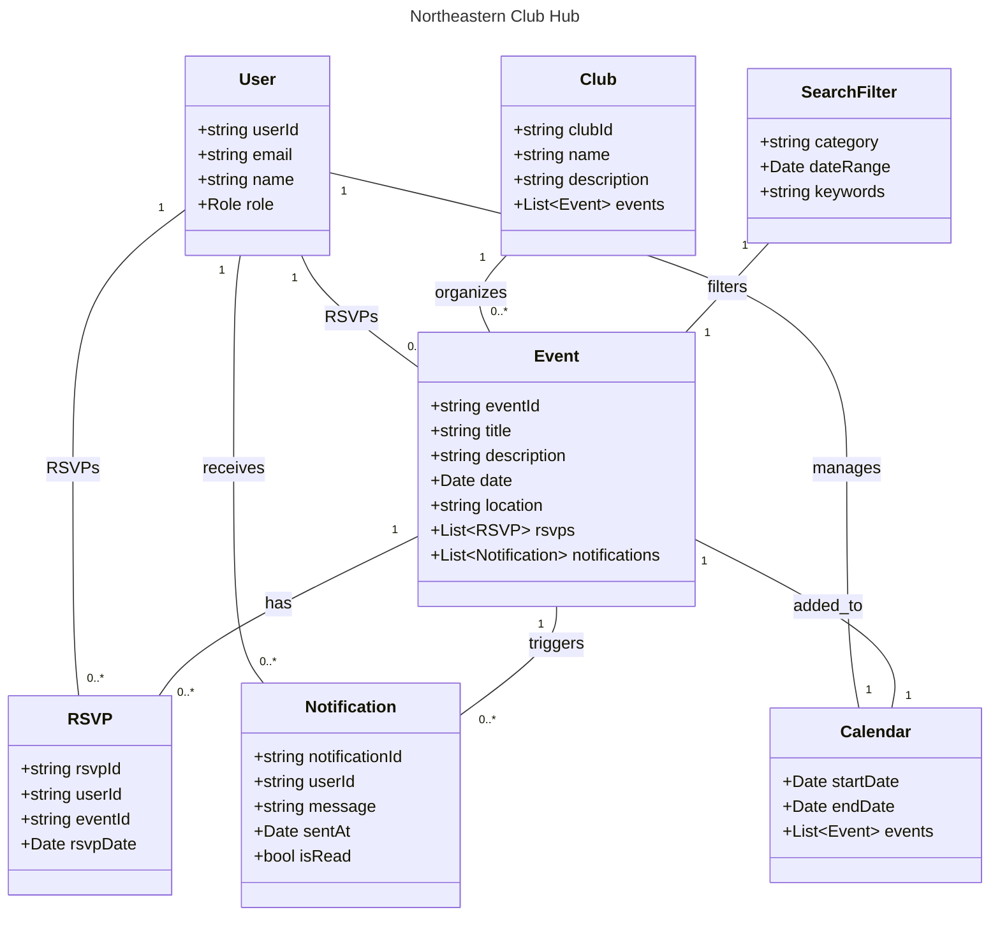

# Northeastern Club Hub

## Project Overview

The **Northeastern Club Hub** is a centralized platform designed for Northeastern University, where all clubs can share events, announcements, and updates. This platform allows students to view all upcoming events in a single portal and receive automatic notifications for new events or announcements, making it easier to stay informed about campus activities.

## Problem Statement

With a large number of clubs at Northeastern, students often miss out on valuable events because information is scattered across various platforms. Following each club on different social media channels is cumbersome and impractical. The Northeastern Club Hub solves this problem by providing a unified platform where all club activities are posted, and students receive automatic notifications for new events.

## Key Features

- **Event Feed**: A unified feed displaying events from all clubs in chronological order.
- **Event Calendar**: An interactive calendar view where students can see all upcoming events by date.
- **Automatic Notifications**: Notifications are sent to all students for new events or announcements from any club, ensuring they stay updated.
- **Search and Filter Options**: Students can search and filter events by category (e.g., cultural, academic, sports) or by date range.
- **Event RSVP and Reminders**: Students can RSVP to events and receive reminder notifications as the event approaches.
- **Club Admin Dashboard**: A dedicated dashboard for club representatives to post and manage events, view RSVPs, and track engagement.

## Technology Stack

- **Frontend**: React
- **Backend**: Node.js with Express
- **Database**: MongoDB
- **Real-Time Notifications**: Firebase Cloud Messaging (FCM) or WebSockets or Azure
- **Authentication**: JWT-based authentication for secure login and role-based access

## Team Members

- Tharun Maheswararao - <maheswararao.t@northeastern.edu>
- Tayyab Mulani - <mulani.ta@northeastern.edu>
- Shriram Azhagarasam - <azhagarasan.s@northeastern.edu>
- Bharath Kumar Tamilselvam - <tamilselvam.b@northeastern.edu>

## Object-Oriented Design (Domain-Driven Design)

The object model below covers all project milestones, representing essential classes, relationships, and the cardinality between them. This design enables the implementation of core functionalities, including user authentication, event management, event discovery, RSVP handling, and club admin dashboard.

Project Demo Link: https://northeastern-my.sharepoint.com/:v:/r/personal/maheswararao_t_northeastern_edu/Documents/Recordings/Call%20with%20Bharath%20and%202%20others-20241207_233724-Meeting%20Recording.mp4?csf=1&web=1&e=hVSAuB&nav=eyJyZWZlcnJhbEluZm8iOnsicmVmZXJyYWxBcHAiOiJTdHJlYW1XZWJBcHAiLCJyZWZlcnJhbFZpZXciOiJTaGFyZURpYWxvZy1MaW5rIiwicmVmZXJyYWxBcHBQbGF0Zm9ybSI6IldlYiIsInJlZmVycmFsTW9kZSI6InZpZXcifX0%3D
